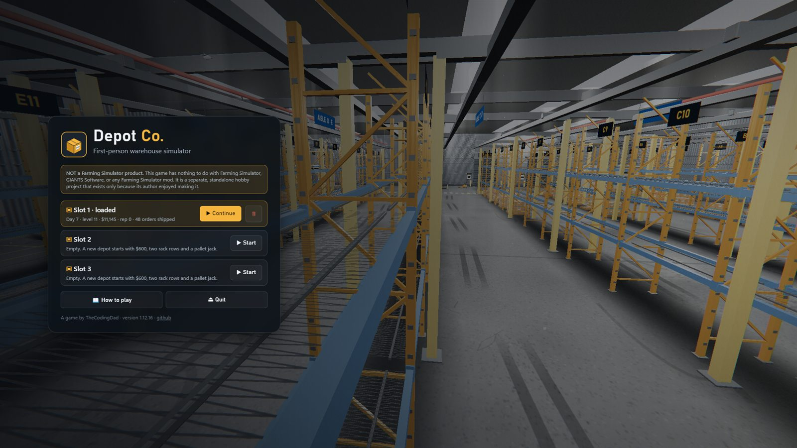

<p align="center"></p>

<p align="center"><b>A first-person warehouse simulator.</b><br>Trucks bring the stock, you rack it, orders come in, you pick, pack and ship them. Then hire a crew and buy a forklift.</p>

> [!IMPORTANT]
> **This is NOT a Farming Simulator product.**
> Depot Co. has nothing to do with Farming Simulator, GIANTS Software, or any Farming Simulator mod, including the Realistic Farming mods by the same author. It is a separate, standalone hobby project, a sibling of [Grow Co.](https://github.com/TheCodingDad-TisonK/Grow-Co), built the same way.



More screenshots: the [gallery](gallery/README.md).

## What it is

You run a small third-party logistics depot. Six clients send stock on inbound trucks; you open the dock door, walk into the trailer, and move the pallets onto the racks by hand, with the pallet jack, or later with the forklift. Their customers order from that stock through the day. You pick the boxes off the racks, pack the order at the bench, carry the parcel into the outbound trailer and send the truck. You are paid a fee for every pallet you receive and a cut of every order that ships on time.

It is one HTML page and plain JavaScript on top of [three.js](https://threejs.org). No framework, no assets to download: every texture, the brand, and every sound is generated in code. The `game/` folder is committed ready to run, so playing or hosting it needs no build step. The desktop app is the same page inside Electron.

## Features

| | |
|---|---|
| **The loop** | Receive, put away, pick, pack, load, dispatch. Sixteen product lines across four tiers, three of them your own brand off the moulding line, six clients with their own tastes, rush orders, short orders, late penalties, contracts. |
| **The hall** | A 72 by 48 metre hall under an 8 metre roof with five rows of skylights, lined with a blockwork dado, steel columns and girts, lit by pooled high bays with a light budget: five rack rows of fifteen bays and three levels, open floor on the receiving side, two inbound and two outbound dock bays with roll-up doors, dock shelters and steps, a walled office with a real in-world PC, an order board, a KPI whiteboard and the breaker panel, an entrance lobby with the time clock and lockers, a walled break room with a cot, a coffee counter, a vending machine and a radio, a working baler and a stretch wrapper, a damaged-goods bin, and everything a worked-in hall has: cable trays, sprinkler mains, extractor fans, fire points, posters, clocks, floor paint and wear. Outside: a fenced yard with V-mesh security fencing, barrier gates and gatehouses with guards, marked truck lanes, a staff car park, a smoking shelter, a silo, named neighbours, and a road with traffic. |
| **Your hands** | Carry one box or one parcel. `E` takes, puts on or uses; `G` puts down. Everything you hold is physically in the world, and a box on the bench is a thing you look at and take, not a line in a menu. |
| **People** | Staff, drivers and guards are rigged figures with knees, elbows, shoes, collars, hair and a face that blinks and looks at you. |
| **Tools** | Two pallet jacks from day one. A picking cart with three shelves that holds twelve boxes or parcels and picks straight off the racks. A forklift you drive, with a proper cab, three gears on Shift, a beacon, a reversing beeper, a battery you plug in by cable at the charging point, and forks that lift to the top rack level. A stretch wrapper: wrap a pallet before you move it fast, or it sheds boxes. |
| **Production** | A wing behind the north wall with a hopper, a moulding line that makes own-brand goods from raw granulate, and a belt into the hall where a palletiser stacks them. Packing is a machine too: infeed belt, case taper, outfeed, gravity shelf. |
| **The hand scanner** | A terminal in your hand on Tab: nine pages (home and alerts, orders and their slots, a pick list in walking order, put-away, stock, docks and bays, plant, crew, and a map of the whole site with you, the crew, the trucks and your waypoint on it), a cursor on the wheel, and F sets a waypoint on anything, a ring and a beam on the floor with the heading on the HUD. Point it at a slot, a pallet, a parcel, a truck or a machine and it reads it. |
| **Three lanes** | Every client ships by sea, land or air, and every order wears its lane on the board: sea leaves by OUT 1, land by OUT 2, air by OUT 3 once it opens. An order is due at the next truck of its own lane. A parcel out of the wrong door still ships, for a forwarding fee. |
| **The mezzanine and the sortation deck** | A steel deck over the receiving strip with a goods lift by the IN docks, an upper rack row and a crane of its own: set a pallet in the lift and it is racked upstairs by itself, and the crane sends boxes down a chute into the pick line. The sortation deck turns it into the parcel floor: every parcel off the pack line rides a spiral up, a scanner reads its lane, three cells crate it for the sea, strap it for the land or bag it for the air, and spirals drop it into the dock loader of its door. It opens OUT 3 and brings the air clients, who pay half as much again, and three deck accounts that order big and pay a third more. Every dock has a shipping bay, a flow rack beside its loader where the sorted parcels wait for their truck, and with the night shift the deck sorts while you sleep. Step-overs cross the deck belts. |
| **Three more halls** | The returns hall east of the production wing, Hall 3 west of it with a third inbound dock, Hall 4 behind the wing: each a hall of its own with roof lights and a doorway cut into the wall it opens off, shuttered until bought. Halls 3 and 4 carry two rack rows each; the returns hall carries the returns operation. |
| **Staff options and the plant page** | A course makes a worker quicker, a raise fixes their timekeeping for good, a shift pattern (early, day, late) and a second role they cover when their own queue is empty; the crew grows to eight at level 7. The Plant page on the office PC runs every machine from the desk, and the inbound consoles sign the delivery note. |
| **Automation** | Shop upgrades that take the work out of your hands: a shipping belt and dock loader at OUT 2, an AGV that puts pallets away by itself, and gantry pickers over every rack row that feed the bench by overhead belts. Every machine is a prop you can move; belts hand items to whatever their end touches. And belts by the piece: straights, curves, inclines and high runs from the catalogue that snap to belt ends, machines, dock doors and rack bays as you carry them, so a line from a rack bay to a dock door is yours to lay. |
| **Drivers** | Every truck has a driver who climbs out, comes in through the dock door with the delivery note, and waits beside it. Nothing comes off an inbound truck until you sign for it. They chat, and they nag when you keep them waiting. |
| **Doors and locks** | Hinged doors on the office, the break room, the staff entrance and the fire exit. E opens, Shift+E locks. A control cabinet by the office switches the hall and yard lights, every dock door, and a night mode that locks the whole place down. Leave something unlocked at night and stock walks. |
| **Returns** | From level 3 the outbound trucks bring the odd parcel back: unwanted, the wrong item, damaged in transit. Take it off the trailer, carry it to the returns desk, and the desk inspects it for a fee. Good boxes go back on the racks, damaged ones in the bin at no charge. From level 7 the **returns hall** takes it all over: a dock and a truck of its own, a belt to the intake, three inspection desks, a restock cage and a compactor. The packer handles them when the bench is quiet; the dock has its own console. |
| **Furniture and comfort** | The rooms come furnished and the shop sells more: sofa, armchair, round table, TV, dartboard, microwave, fan, rugs, bookshelf, printer, pictures. What stands in the rooms is the depot's comfort, and comfort shortens the crew's breaks. |
| **The day report** | Every day roll closes the day: money in and out, shipped and late, pallets in, returns, reputation, the bank. A card on the HUD, and a fortnight's table on the office PC. |
| **Photo mode** | F9 frees the camera and hides the HUD while the world holds still; F12 takes the picture. |
| **Weather and seasons** | Four seasons of seven days. Rain, storms with lightning, overcast skies, and snow that settles on the yard. A radio in the break room with three synthesized stations. Sunday is closed. |
| **The office PC** | Orders, the shop (cart, rack rows, forklift, LED high bays, a second inbound bay, a roadside sign), staff, finance with a full ledger, stock, lifetime stats. |
| **Staff** | A receiver who empties trucks onto the racks with a pallet jack of their own, a picker who feeds the bench and walks the surplus back, a packer who releases orders to the pack line and loads the parcels, and a forklift driver who puts floor pallets away on any level and parks the forklift back in its bay. They arrive through the yard, clock in at the time clock, break at noon, and are paid by the hour from their timesheet with overtime after ten. They never open a dock door: that stays your job. |
| **Trouble** | Power cuts that kill the doors and the PC until you reset the breaker. A safety inspector who fines you for boxes left on the floor. A prowler who takes stock through a dock door left open at night. |
| **A day** | Sixteen working hours in twenty minutes. Trucks on a fixed timetable, a night that runs fast, a cot that skips to morning and charges rent and wages. |
| **Progress** | Levels unlock lines, upgrades and staff. Reputation brings more and bigger orders. A guided intro walks a new depot through its first truck and first shipment for a $400 bonus. |
| **Three save slots** | Three depots side by side, each deleted on its own. Any save exports as text or a `.json` file and loads back from the pause menu. |

## Install and play

**Windows:** the installer from the Releases page (`Depot-Co-Setup-<version>.exe`) puts it in your Start menu and on the desktop.

**Any browser:** clone the repo and run `node tools/serve.js`, then open `http://127.0.0.1:8430/`. Or point any static web server at the `game/` folder. Chrome, Edge and Firefox work; the game wants pointer lock, so it runs in a page you have clicked.

**From source with Electron:** `npm install` then `npm start`.

## Controls

| Key | Does |
|---|---|
| `W A S D` · `Shift` · `Space` | Move, run, jump |
| `E` | Use, pick up, put on the rack or the bench, lift with the jack, pack, load |
| `G` | Put down what you hold, let go of the jack or cart, get off the forklift |
| `Tab` · `1`-`9` | Hand scanner and its pages; the wheel moves its cursor, `F` sets a waypoint, `X` clears it |
| `W S A D` · `R F` on the forklift | Drive, steer, raise and lower the forks |
| `F9` | Photo mode: a free camera with the HUD off |
| `Esc` | Pause menu: settings, guide, stats, save file |
| `F3` · `F12` · `F11` | FPS counter, screenshot, fullscreen |

## Building

```
npm run build       # joins src/ into game/depot.js and writes game/version.js
npm run check       # refuses to pass if game/depot.js is not what src/ builds
npm test            # the smoke test: boots the real game headless and plays several days through it
npm run brand       # redraws the logo and wordmark
npm run installer   # the NSIS installer in dist/ (needs the icon from npm run icon)
```

Never edit `game/depot.js` by hand: edit `src/` and build. See `docs/Architecture.md`.

## Licence

MIT. Made by TheCodingDad.
