# Depot Co. gallery

Screenshots from the game, newest layout (the 72 by 48 m hall, cranes over every row, two jacks). Back to the [main README](../README.md).

| | |
|---|---|
| 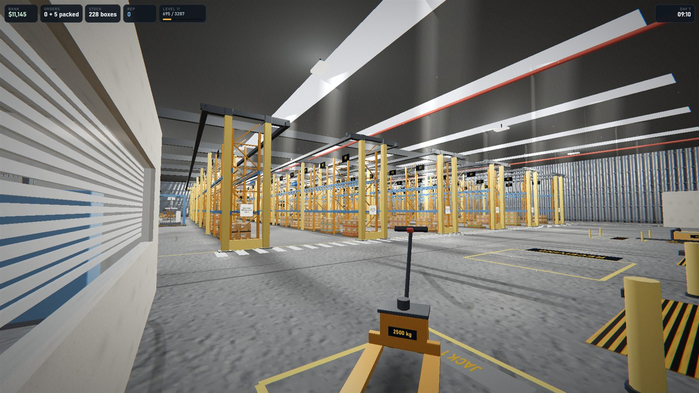 | 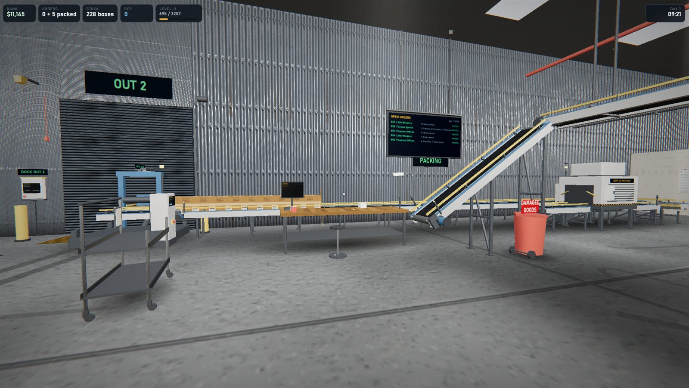 |
| Jack 1 in its bay by the IN docks, with the receiving square and the rack rows beyond | The packing bench, the order board, the pack line and the pick belt ramping down from the cranes |
| 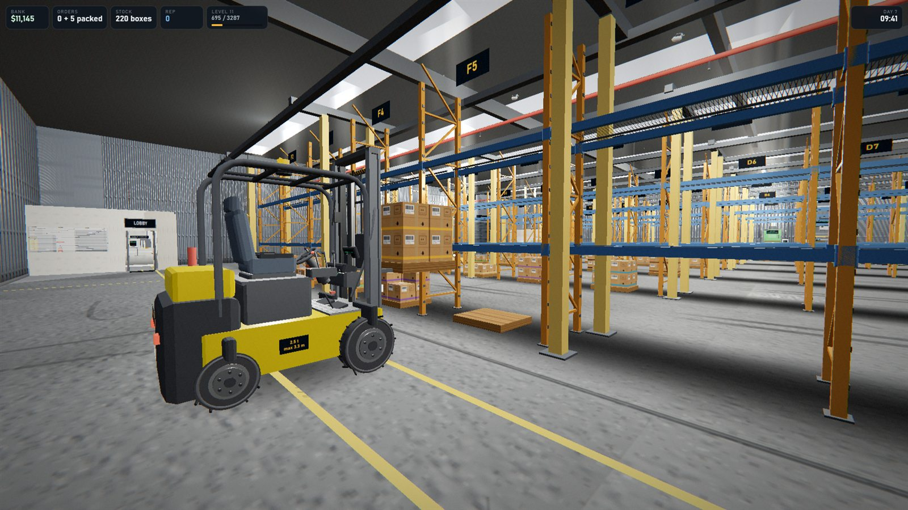 | 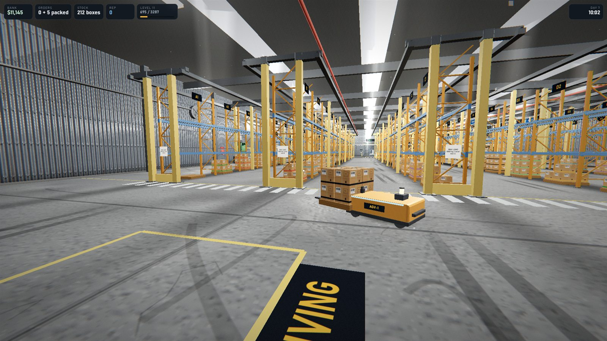 |
| The forklift with a pallet on its forks at the shelf level | AGV-1 taking a pallet off the receiving square to the racks |
| 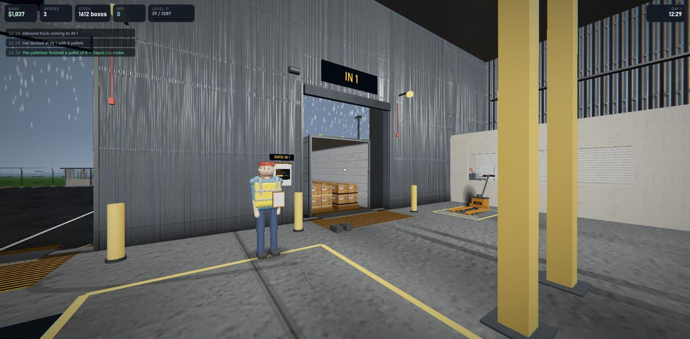 | 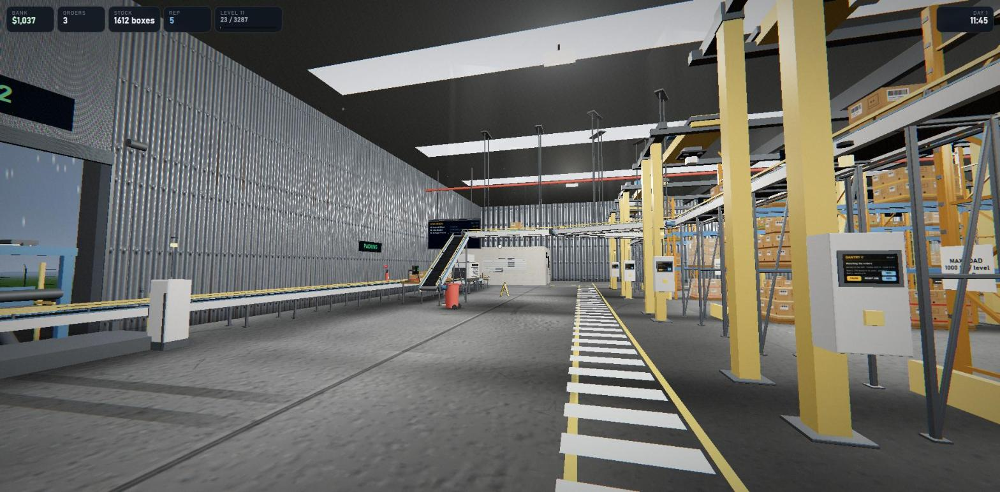 |
| A truck docked at IN 1, its driver waiting with the delivery note | The east lane: crane cabinets with their screens, the pick belts hung overhead, the merge belt down to the bench |
| 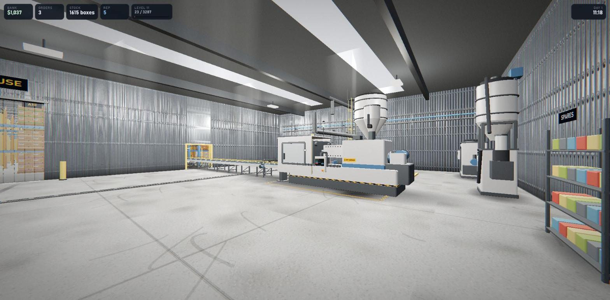 | 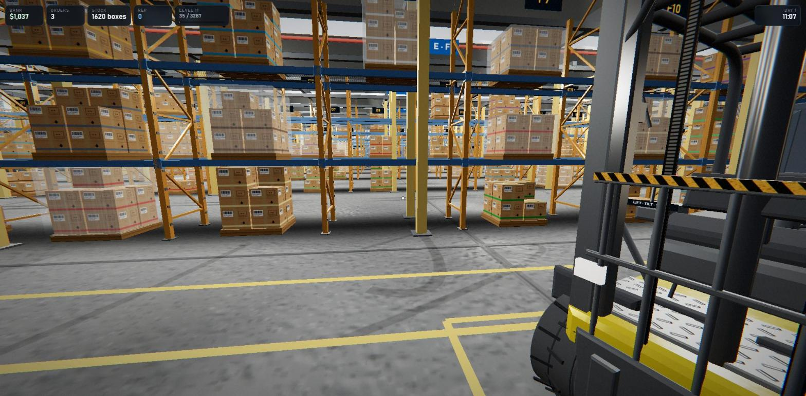 |
| The production wing: the moulding line, the raw hoppers and the belt back into the hall | Stocked rack rows seen from the forklift bay |
| 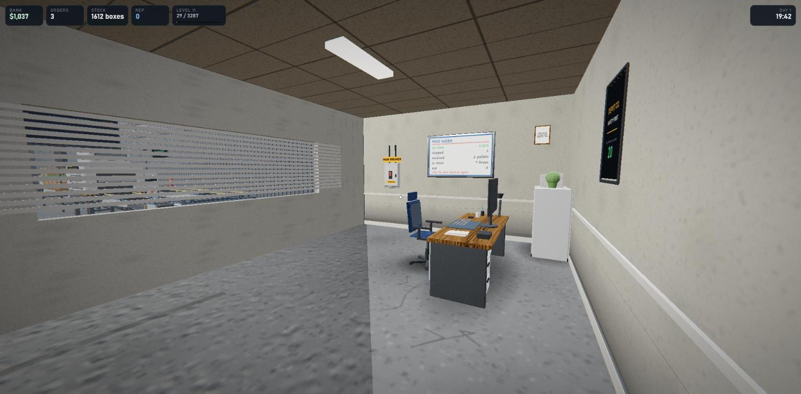 | 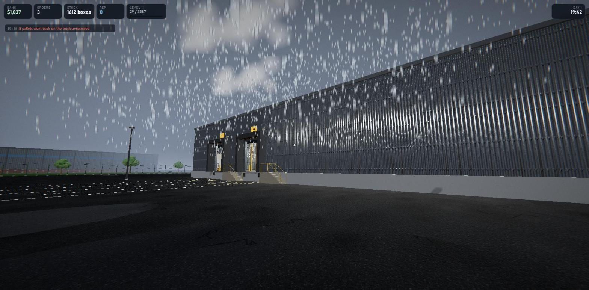 |
| The office: the PC, the week board and the main breaker | The yard at dusk in the rain, the IN docks from outside |
| 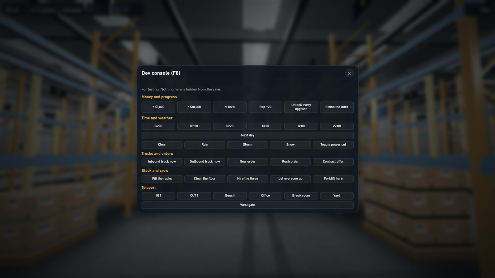 | |
| The dev console on F8: money, time, weather, trucks, crew and teleports for testing | |
